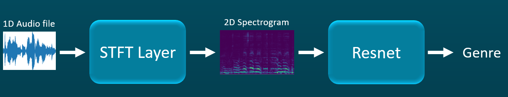

# Adaptive STFT: Classify Music Genres with a learnable spectrogram layer
<h2 align="center">
  <br>
 Our final project for the Technion's EE Deep Learning course (046211)
  <br>
  
</h1>
  <p align="center">
    Noam Elata: <a href="https://www.linkedin.com/in/noamelata/">LinkdIn</a> , <a href="https://github.com/noamelata">GitHub</a>
  <br>
    Rotem Idelson: <a href="https://www.linkedin.com/in/rotem-idelson/">LinkdIn</a> , <a href="https://github.com/RotemId">GitHub</a>
  </p>

## Agenda
- [Ada-STFT](#Ada-STFT) - about our project
- [Our-Model](#Our-Model) - about our project
- [Results](#Results) - our results
- [Hyper-parameters](#Hyper-parameters) - what are our training's hyperparameters
- [Run-our-model](#Run-our-model) - how to run training jobs and inference with our model and how to load checkpoints
- [STFT-Moudle](#STFT-Moudle) - how to use our STFT layer
- [Prerequisites](#Prerequisites) - Prerequisites of the environment

# Ada-STFT
Expanding on existing application of image processing networks to audio using STFT, we propose an adaptive STFT layer that learns the best DFT kernel coefficients and window coefficients for the application. 

The task of audio-processing using neural networks has proven to be a difficult task, even for the state of the art 1-Dimension processing network.
The use of STFT to transform an audio-processing challenge into an image-processing challenge enables the use of better and stronger image-processing networks, such as Resnet.
An example of such uses can be found in this <a href="https://arxiv.org/abs/1706.07156">paper</a>.
Because STFT is in essence a feature extractor, base on applying 1-Dimension convolutions, we propose a method to simplify the translation of 1-D sequences into 2-D images.
We will also improve the vanilla STFT by learning task-specific STFT window coefficients and DFT kernal coefficients, using pytorch's build in capabilities.

In this project, we implemented a toy example of an audio-processing problem - music genre classification - to show the advantages of Ada-STFT.
We have tried to classify the genre of an audio part from the <a href="https://www.kaggle.com/andradaolteanu/gtzan-dataset-music-genre-classification/code">GTZAN dataset </a>.
The music classification task is based on a project done in the technion in 2021, and can be found <a href=https://github.com/omercohen7640/MusicGenreClassifier>here</a>.

# Our-Model




# Results


# Hyper-parameters

|Parameter | Type | Description |
|-------|------|---------------|
|test_name| string | your trial's name|
|resume| int | 0 if we start a new training and 1 if we resume old training|
|ckpt_interval| int | epoch interval to save a new checkpoint |
|tensorboard_dir| string | path to tensorboard log directory |
|data_dir| string | path to dataset directory |
|ckpt_dir| string | path to checkpoint directory |
|ckpt_file| string | path to ckpt file to be loaded |
|learn_window| int | 0 if we don't won't to learn stft window coefficients, 1 if we do |
|learn_kernels| int | 0 if we don't won't to learn stft kernels coefficients, 1 if we do |
|batch_size| int | size of batch |
|num_workers| int | data loader's parameters: number of workers to pre-fetch the data |
|epoch_num| int | number of total epoches to run |
|learning_rate| int | optimizer's learning rate |
|split_parts| int | to how many parts to split our original audio file. can be: 1, 3, 4, 6, 12|
|gamma| int | scheduler's gamma |
|cpu| int | 0 if we want to try and run on gpu, else if we want to run on cpu |
|augmentation | int | 0 if we don't want to use augmentation, else if we do |
|three_widows| int | 0if you want to learn 1 stft, else if you want to earn 3 |
|optimizer_class| string | optimizer type: "SGD" or "AdamW" |

## changing hyper-parameters
Parameters are automatically loaded from the options.json in the project directory.
Changes to the parameters can be applied by changing the `options.json`.
We also  implemented argparse library, so you can load your parameters with your IDE's configure or within th command line.
Examples are shown in the Run-our-model section.

# Run-our-model

## dataset
Our dataset is: <a href="https://www.kaggle.com/andradaolteanu/gtzan-dataset-music-genre-classification/code">GTZAN dataset </a>,
Our code use pytorch dataset to load it. You can set the path to your data directory with the data_dir hyper-parameter.

## Chekpoints
You should set the ckpt_dir parameter as the father checkpoints directory, and ckpt_file as the file name.
For example, if you set the folowing parametrs as:
`ckpt_dir = "checkpoints"`, `test_name = "my_test.pt"`, `ckpt_dir = "best_ckpt.pt"`,
than the checkpoints file full path that will beloaded is: `\checkpoints\my_test\best_ckpt.pt`

## Training Music Genre Classifier
To train our classifier network, run `train_env.py`.
```cmd
python ./train_env.py --test_name run_basic
```
training job parameters are automatically loaded from the options.json in the project directory.
Changes to the parameters can be applied by changing the `options.json` or running with command line arguments, for example:
```cmd
python ./train_env.py --test_name run_learn_window --learn_window 1
```

## Inference Music Genre Classifier
Run the `test.py` with the `test_name` argument set to the name of the model being inferenced.
Setting the `test_name` argument can be done through `options.json` or through command line:
```cmd
python ./test.py --test_name my_test --ckpt_dir checkpoints --ckpt_dir best_ckpt.pt
```

# STFT-Module

## How to use our module
```python
import torch
from torch import nn
from resnet_dropout import *
from stft import STFT

class Classifier(nn.Module):
    def __init__(self, resnet=resnet18, window="hanning", num_classes=10):
        super(Classifier, self).__init__()
        self.stft = STFT(window=window)
        self.resnet = resnet(num_classes=num_classes)

    def forward(self, x):
        x = self.stft(x)
        x = self.monochrome2RGB(x)
        return self.resnet(x)

    @staticmethod
    def monochrome2RGB(tensor):
        return tensor.repeat(1, 3, 1, 1)
```

## STFT Layer Parameters
|Parameter | Description |
|-------|---------------------|
|nfft| window size of STFT calculation|
|hop_length | STFT hop size, or stride of STFT calculation|
| window | type of window to initialize the STFT window to, one of the windows implemented in scipy.signal|
| sample_rate | sampling rate for audio|
| num_mels | number of mel scale frequencies to use, None for don't use mel frequencies|
| log_base | base of log to apply  to STFT, None for no log|
| learn_window | should window be learned (can be set after layer initialization)|
| learn_kernels | should DFT kernel be learned (can be set after layer initialization)|


# Prerequisites
|Library         | Version |
|--------------------|----|
|`Python`|  `3.5.5 (Anaconda)`|
|`scipy`| `1.7.3`|
|`tqdm`| `4.62.3`|
|`librosa`| `0.8.1`|
|`torch`| `1.10.1`|
|`torchaudio`| `0.10.1`|
|`torchaudio-augmentations`| `0.2.3 (https://github.com/Spijkervet/torchaudio-augmentations)`|
|`tensorboard`| `2.7.0`|

Credits:
* Music Genre Classifier Project for classifier network architecture https://github.com/omercohen7640/MusicGenreClassifier
* Animation by <a href="https://medium.com/@gumgumadvertisingblog">GumGum</a>.
* STFT implemenation https://github.com/diggerdu/pytorch_audio

